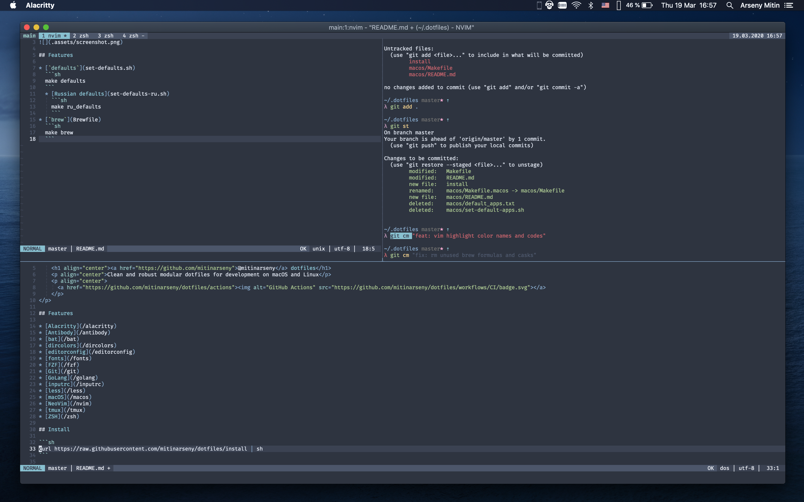

# macOS



## Features

* [defaults](set-defaults.sh)
  * [russian](set-defaults-ru.sh)
* [brew](Brewfile)

## Install

```sh
# defaults only
make

# russian defaults
make ru_defaults

# brew formulas and casks
make brew
```

