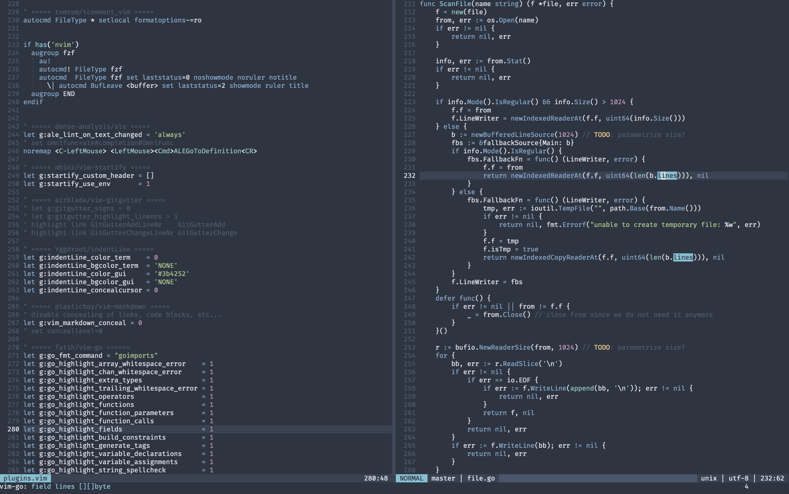

# NeoVim



## Install
```sh
make
```

## Key Bindings

### Editing

| Normal       | Insert       | Visual       | Description                     |
|:------------:|:------------:|:------------:|---------------------------------|
| `<C-_><C-_>` | `<C-_><C-_>` | `<C-_><C-_>` | comment current line            |
| `<A-BS>`     | `<A-BS>`     |              | delete word backwards           |

### Navigation

| Normal       | Insert       | Visual       | Description                     |
|:------------:|:------------:|:------------:|---------------------------------|
| `<C-f>`      | -            | -            | open fzf                        |


### Spell


| Normal       | Insert       | Visual       | Description                             |
|:------------:|:------------:|:------------:|-----------------------------------------|
| `zg`         | -            | -            | add word under cursor to the dictionary |

## TODO

* move + arrows
* delete one word backwards (nvim + zsh)
* home jump to the firstnon-space char of the line
* shift + home selects until the first char, next shit+home til the real beginning
* golang auto-fill struct fields
* do not complete empty line
* fugitive less check frequency
* selection + tab indent, shift + tab unindent
* delete selection with backspace

