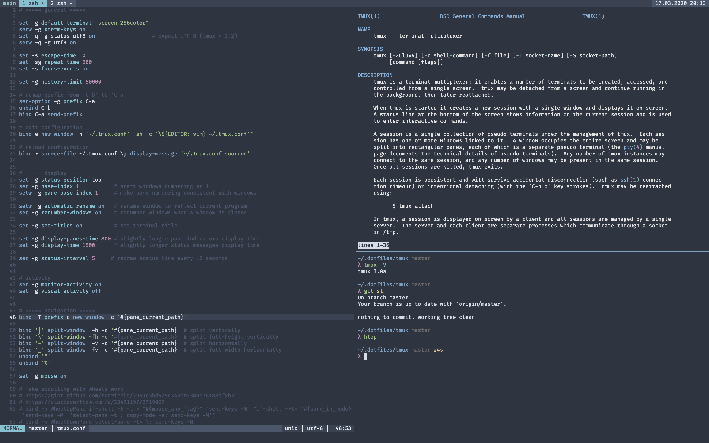

# tmux



## Install

```sh
make
```

## Aliases

| Alias | Description                                          |
|:-----:|------------------------------------------------------|
|`tm`   | attach to `main` session, or create it if not exists |

## Key bindings

> `<Prefix>` is set to `<C-a>`

### Panes

| `<Prefix> +`                                | Description                         |
|:-------------------------------------------:|-------------------------------------|
| `<Up>`                                      | go to pane on the top               |
| `<Down>`                                    | go to pane on the bottom            |
| `<Right>`                                   | go to pane on the right             |
| `<Left>`                                    | go to pane on the left              |
| `<Left \| Right>`<br>(with `<Preifx>` hold) | resize pane horizontally            |
| `<Up \| Down>`<br>(with `<Preifx>` hold)    | resize pane vertically              |
| `<Enter>`                                   | maximize/minimize current pane      |
| `\|`                                        | split vertically                    |
| `\`                                         | split vertically full-height        |
| `-`                                         | split horizontally                  |
| `_`                                         | split horizontally full-width       |
| `>`                                         | swap current pane with the next one |
| `<`                                         | swap current pane with the next one |
| `x`                                         | kill current pane                   |

### Tabs

| `<Prefix> +` | Description                           |
|:------------:|---------------------------------------|
| `c`          | create new tab with current directory |
| `<Tab>`      | forward circle through tabs           |
| `<S-Tab>`    | backward circle through tabs          |
| `l`          | go to previously opened tab           |
| `&`          | kill current tab                      |

### Config

| `<Prefix> +` | Description         |
|:------------:|---------------------|
| `e`          | edit `~/.tmux.conf` |
| `r`          | reload config       |

### Common

| `<Prefix> +` | Description           |
|:------------:|-----------------------|
| `?`          | list all key bindings |
| `/`          | prompt for man pages  |
| `S`          | prompt for ssh        |
